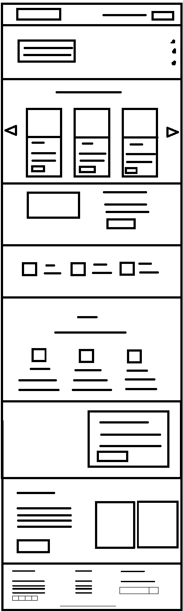
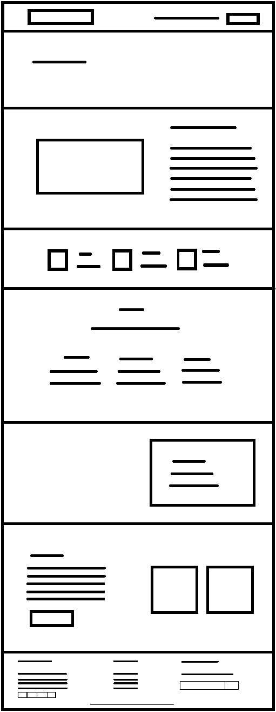
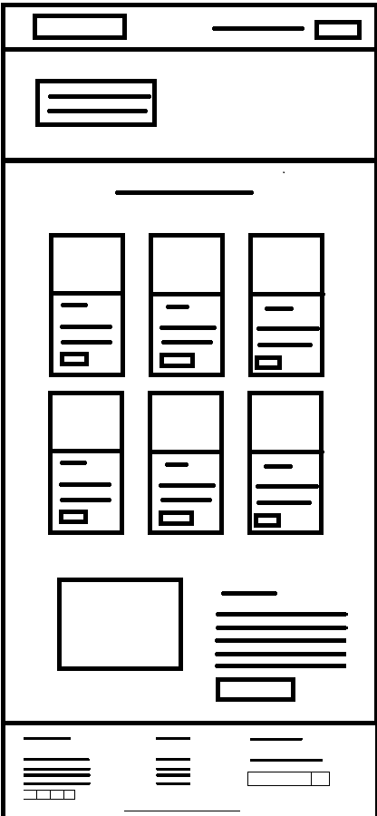
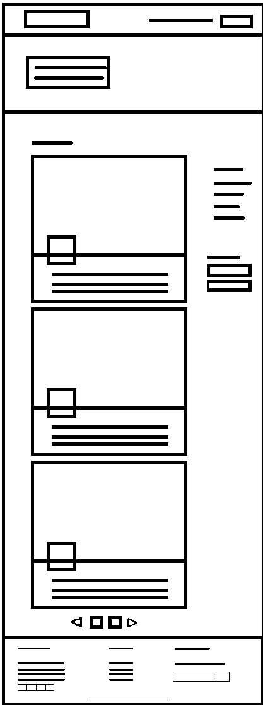
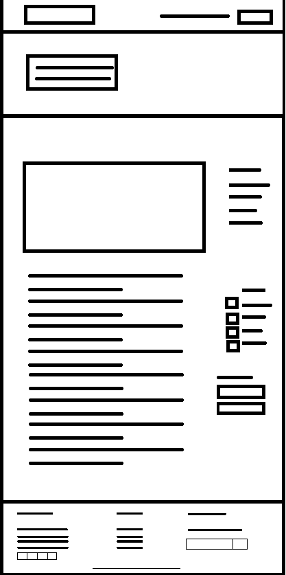
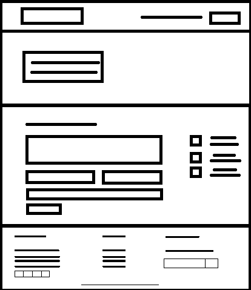
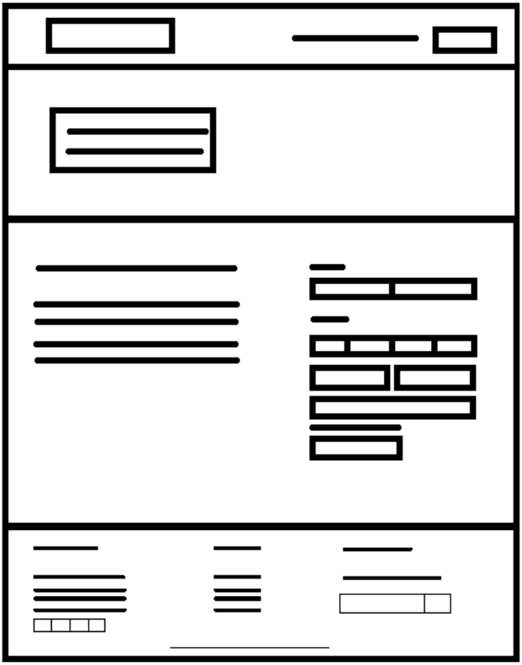

# C2 : User Interface

Our project uses the Boostrap framework that makes this project a lot easier for us as by using the correct css tags we can easily make our website responsive on multiple devices. Below we will present some important points that we decided to highlight in the structure of our project.

## 2.1 Interface and Common features

Before starting our project we decided to create a set of sketches that would allow us to easily organize all our goals as it was much easier to create the page from our sketches.

### 2.1.1 Sketchs

#### Home Page

In index.html page is divided into several sections, one of which is the slider containing text boxes and three buttons. Each button is directed to a specific page.
We have a part about the projects that our organization is currently hosting. Containing several images, as text boxes and buttons directed to the page of "donations.html".
A section with a brief introduction to who we are as organization containing a button to access the "about_us.html" page to gain more knowledge about us. We display data about 
projects that are active, the number of people who supported at least one project, such as projects made per year and people who have been helped through our projects. We display 
our goal as well as some of our values. The next section contains a text box and a button that will take us to the "donations.html" page. And finally we have the contact section 
that includes a button to access the contact page ("contact_us.html").

_Home Sketch_

#### About Us Page

This page is divided into 5 sections. The first tells us about who we are as an organization containing an image and a text box. We represent some data displayed about the projects 
like people who joined the projects. We have a section where we demonstrate our goal and our values. Clearly we have section talking about our team containing an image and text box. 
And finally the contact section containing images, text box and a button that takes us to the "contact_us.html" page if the user wishes to establish any contact with the company.

_About Us_

#### Projects Page

On the "projects.html" page we then display our projects that are currently active containing, images, text box and buttons that direct us to the page "donations.html". And finally, 
another section that displays a image and contains a text box and a button for the donations page.

_Projects_

#### Blog Page

Here's some news. We have a section where the news is divided by categories, as well as a place to enter the email if you want to receive the news by email (Note: This section 
it was not proposed by the professor, so the form information was not processed). A paging system is present to limit the number of news per page. By 
clicking on the title of a news story, you can read any report. 

_Blog_

#### Blog Details Page

When you click on a title this page will be displayed. Here the content of the news is shown in full form also includes the category sections as well as newsletter adding even more 
a section showing the recent posts.

_Blog Details_

#### Contact Us Page

A form is present on the contact page, which is currently not available as it was not proposed by the professor, so the form information was not processed. Also present is the 
company's email, as well as the phone number and where the headquarters is located.

_Contact Us_

#### Donations Page

And finally, we have the donations page where the user can easily choose an amount to donate to our organization, however this is not available since it was not something proposed 
by the teacher. We have a form that displays the type of payment you want to donate as well as the amount established along with a field for the name and email.

_Donations_

### 2.1.2 Sitemap

_Add a diagram of your (Visual) sitemap. I'm not expecting a [XML Sitemap](https://developers.google.com/search/docs/advanced/sitemaps/build-sitemap#expandable-1) ([Wikipedia](https://en.wikipedia.org/wiki/Sitemaps))_  

_In the previous sections I'm using a table to organize the figures in the space, but it is not required_

Here are two examples of a site map

  
Always add a description to help the user understand the figure  

  
Always add a description to help the user understand the figure  

---
[< Previous](c1.md) | [^ Main](../../../) | [Next >](c3.md)
:--- | :---: | ---: 
