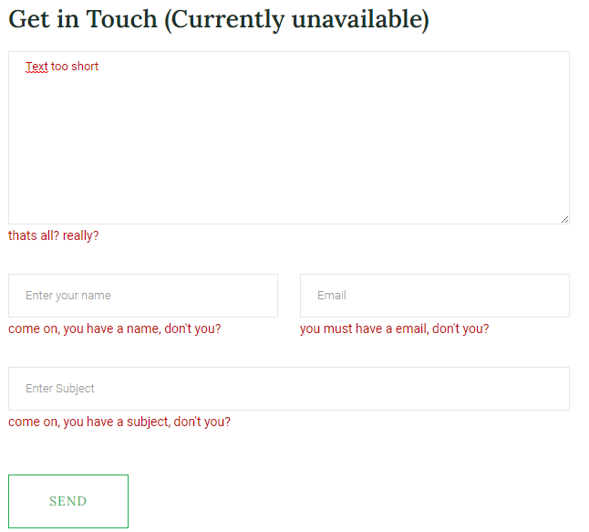
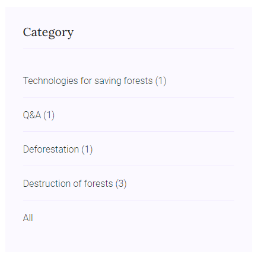
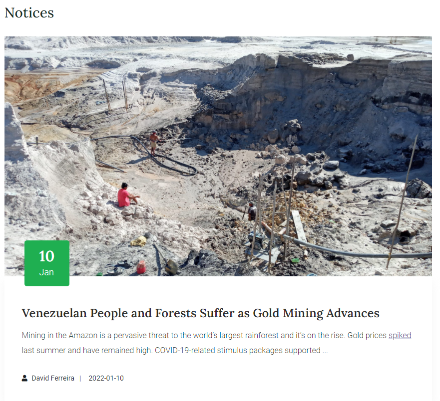
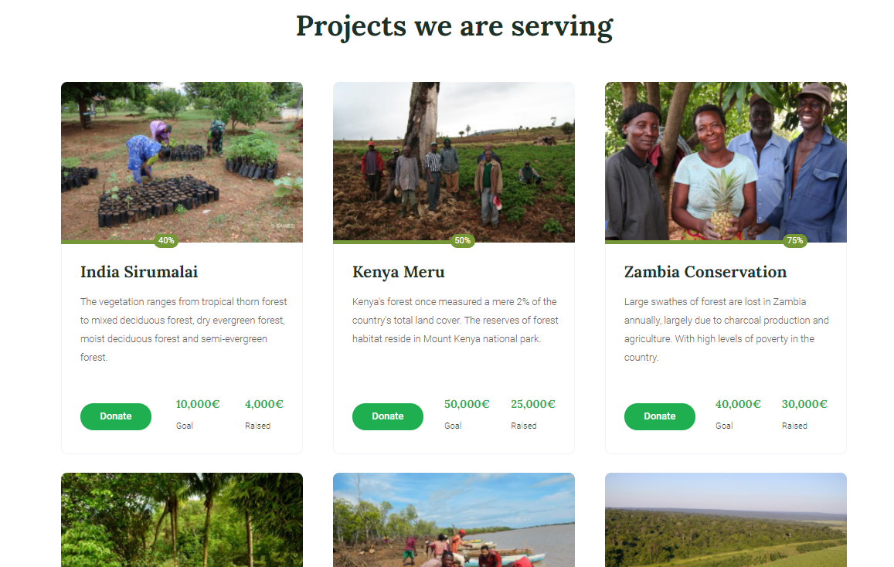
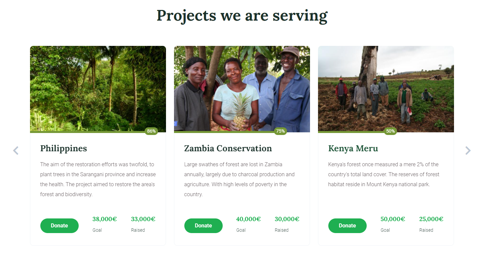

# C3 : Product

The project is about an international non-profit organization called SaveTheForest.

The code has been tested several times with the focus of creating something clean, fast, easy to understand and optimized. We were very careful to follow all the conventions both in formatting and commenting all lines of code as well as applying principles like SOLID KISS DRY. 

With the need to work in groups was proposed the use of visual studio code software, in addition to this was already familiar by both members of the group, visual studio allows 2 or more members to be working on the same project live from a plug-in which allows when a person makes a change, the other receives the new update in real time.

We decided to use github because we are very used to using it in addition to all the advantages and features that it brings to the user. Same thing for visual studio code, it was quite easy to work on visual studio code as we already had experience in it.

It is possible to access the site from the [netlify](https://www.netlify.com) platform by this [link](https://tiwm21-ti-g05.netlify.app)

## 3.1 Instalation

It is expected that the user who wants to install/run any application of this project has the minimum knowledge in working with command lines as well as using dialogs via command lines.

In order to run our project it is necessary to have some type of program that allows the website to run from a server so we decided to use wamp server.

According to [Hostinger Tutorials](https://www.hostinger.com/tutorials/what-is-wamp)

> WAMP is an acronym that stands for Windows, Apache, MySQL, and PHP. It’s a software stack which means installing WAMP installs Apache, MySQL, and PHP on your operating system (Windows in the case of WAMP). Even though you can install them separately, they are usually bundled up, and for a good reason too.
WAMP acts like a virtual server on your computer. It allows you to test all WordPress features without any consequences since it’s localized on your machine and is not connected to the web.

After downloading the project it was only necessary to move it to "www" folder and access the respective address by your browser (In our case: http://localhost/savetheforest/src).

## Technologies

The following technologies were used for the development of this project:

* [HTML5](https://www.techradar.com/news/internet/web/html5-what-is-it-1047393)
* [CSS3](https://www.techradar.com/news/internet/web/html5-what-is-it-1047393)
* [Javascript](https://developer.mozilla.org/pt-BR/docs/Learn/JavaScript/First_steps/What_is_JavaScript)
* [XML](https://www.w3schools.com/xml/xml_whatis.asp)

## Frameworks and Libraries

### JQuery

jQuery is a lightweight, "write less, do more", JavaScript library. The purpose of jQuery is to make it much easier to use JavaScript on your website. jQuery takes a lot of common tasks that require many lines of JavaScript code to accomplish, and wraps them into methods that you can call with a single line of code. jQuery also simplifies a lot of the complicated things from JavaScript, like AJAX calls and DOM manipulation.

There are lots of other JavaScript libraries out there, but jQuery is probably the most popular, and also the most extendable.

In our case, the need to use jQuery was due to the fact that we want to use other libraries that use jQuery as a basis for their operation.

#### Why jQuery?

1. JavaScript enhancement without the overhead of learning new syntax;
2. Ability to keep the code simple, clear, readable and reusable;
3. Eradication of the requirement of writing repetitious and complex loops and DOM scripting library calls;
4. Ease of use- it is more easy to use than the standard javascript and other libraries;
5. Large library – It has a lot of functions compared to javascript;
6. Strong opensource community – there are a lot of plugins available for the faster development of the applications;
7. Great documentation and tutorials – the jQuery website has plenty of tutorials that are required for the beginners;
8. Ajax support – They let you develop the templates easily.

### JQuery Barfiller

JQuery Barfiller is a library that uses jQuery and provides percentage-based animated bar padding.

### JQuery Form

JQuery Form is a library that uses jQuery and allows you to easily and unobtrusively upgrade HTML forms to use AJAX. The main methods, ajaxForm and ajaxSubmit, gather information from the form element to determine how to manage the submit process. Both of these methods support numerous options which allows you to have full control over how the data is submitted. Submitting a form with AJAX doesn't get any easier than this!

### JQuery Validate

JQuery Validate is a library that uses jQuery and makes simple clientside form validation easy, whilst still offering plenty of customization options. It makes a good choice if you’re building something new from scratch, but also when you’re trying to integrate something into an existing application with lots of existing markup.

### JQuery Magnific Popup

JQuery Magnific Popup is a library that uses jQuery and is a responsive lightbox & dialog script with focus on performance and providing best experience for user with any device.

### JQuery Nice Select

JQuery Nice Select is a library that uses jQuery and replaces native select elements with customizable dropdowns.

### JQuery Slicknav

JQuery Nice Select is a library that allows a responsive mobile navigation by a responsive menu.

### CounterUp

Counter-Up is a lightweight module with zero dependencies that counts up to a targeted number when the number becomes visible.

### Popper

Given an element, such as a button, and a tooltip element describing it, Popper will automatically put the tooltip in the right place near the button.

It will position any UI element that "pops out" from the flow of your document and floats near a target element. The most common example is a tooltip, but it also includes popovers, drop-downs, and more. All of these can be generically described as a "popper" element.

### Slick

Slick is a module that allows you to create carousel's

### Bootstrap

Bootstrap is the most popular HTML, CSS and JavaScript framework for developing a responsive and mobile friendly website and it is absolutely free to download and use.
It is a front-end framework used for easier and faster web development and includes HTML and CSS based design templates for typography, forms, buttons, tables, navigation, modals, image carousels and many others with a possibility to be used with JavaScript plug-ins and even facilitates you to create responsive designs.

#### Why use Boostrap?

1. Fewer Cross browser bugs;
2. A consistent framework that supports major of all browsers and CSS compatibility fixes;
3. Lightweight and customizable;
4. Responsive structures and styles;
5. Several JavaScript plugins using the jQuery;
6. Good documentation and community support;
7. Loads of free and professional templates, WordPress themes and plugins;
8. Great grid system.

### SASS

Sass is a CSS preprocessor witch is a layer between the stylesheets you author and the .css files you serve to the browser. Sass (short for Syntactically Awesome Stylesheets) plugs the holes in CSS as a language, allowing you to write DRY code that'll be faster, more efficient, and easier to maintain.

#### Why use SASS?

Stylesheets are getting larger, more complex, and harder to maintain. This is where a CSS pre-processor can help.

Sass lets you use features that do not exist in CSS, like variables, nested rules, mixins, imports, inheritance, built-in functions, and other stuff.

#### How does SASS work?
A browser does not understand Sass code. Therefore, you will need a Sass pre-processor to convert Sass code into standard CSS.

This process is called transpiling. So, you need to give a transpiler (some kind of program) some Sass code and then get some CSS code back.

## 3.2 Usage

Regarding access, as it is a system that does not use any kind of server-side technology, you don't need to do anything else, just access the website and explore.

## 3.3 Application/Product help

The website contains a header and a footer that contains all the main links of the website which allows the user to easily navigate through all the pages.

Regarding the structuring of the website, it is quite easy for the user to find the main information that follows the convention of all websites that would be a Main Page, an About Us and a Contact Us.
On the other pages we have a page reserved to show all our projects, we also have two pages reserved only for blogs that would be to find blogs as well as see the details of each news and finally the donation page that allows the user to help our cause by donating.

## 3.4 Forms

Forms on a website are very important as they are one of the means by which the user interacts with the website and transmits information to other people. Based on this, the validations of each form are also very important because they ensure that the user is entering data that is in accordance with what the form asks for.

Therefore, a system of forms was designed where the user can easily know what it is about as well as from the validations to make the user put the correct information.

It is important to note that for the development of the forms it was decided to use two libraries, the [JQuery Form](https://malsup.com/jquery/form/) that is responsible for all the form logic and the [JQuery Validate](https://jqueryvalidation.org) which handles all the validations of the form in question in a very interactive way as we can see in the example below:

  
_Example of a form validation_

Based on this information described above, a form was created for the Contact Us page and for the Donation page.

There are a few more cases that are not using the validation system as it is not necessary as you can see in the footer for the user to subscribe to the newsletter, among others.

## 3.5 HTML5 and CSS3 validation

_Describe the method used to validate HTML and CSS. Don't forget to add details about the used validators. Show the validation results._
_Add images, tables or reports of the tests performed._

When we are creating a document there is always the possibility of having semantic errors and validators are very important because they allow the developer to be sure that everything he has done is correct and valid. That's why there are several sites that allow the developer to put their code and with a simple click this code can be validated.

It was then that we decided that our code would have to be validated by the tool [Markup Validation Service](https://validator.w3.org) and [CSS Validation Service](https://jigsaw.w3.org/css-validator/)

Regarding the HTML structure there is no problem to validate however in the CSS as we are using SASS when it compiles to css however there are cases where some browsers still support certain tags that are no longer recommended. While some browsers may still support it, it may have already been removed from the relevant web standards, it may be in the process of being phased out, or it may be kept for compatibility purposes only, therefore SASS add new attributes only for the other browsers that still support it like Safari or Safari on IOS according to [MDN Web Docs](https://developer.mozilla.org/en-US/docs/Web/CSS/@media/-webkit-transition)

## 3.6 Application

### Structure

#### HTML

The page is divided into 7 pages:

* Home
* About Us
* Projects
* Blog
* Blog Details
* Contact Us
* Donations

Each page contains a javascript file even if it is not being used in [this folder](../src/assets/js/pages)

### XML Fetch

XML technology is used in 2 places, blogs and projects. Basically XML is read on the client side and is converted to a javascript object structure and from there each page uses the data according to what it needs.

#### Blog

In the case of the blog, the data is read and all the news is displayed, sorted by the most recent to the oldest for the user. In addition, this page also has a pagination system that allows 3 items per page and is all based on javascript, which allows the user to not have to refresh the page.

In addition, the page presents a system of categories where it allows the user to filter the news that he wants to see based on their category as we can see in the image below:

  
_Blog Categories_

##### Blog Details

For the user to access the blog details page, he needs to click on each news item on the blog page and after that the user will be able to see all the information depending on the news that he clicked. This is possible due to an attribute that is passed in the url of the page called "blog_id" that stores the id of the news so that the system based on this information can find the corresponding news.

All this information is being fetched by [this file](../src/xml/blog/blog.xml)

Also on this page it is possible to view the categories as presented in the previous category as all the recent news that the system can display the first 4 news that are sorted by date.

All the news are being imported and presented to the user as shown below:

  
_Blog Notices_

#### Projects

For the projects section, the same thing was done on the blog but for the [projects xml file](../src/xml/blog/blog.xml).

On this page, then, all projects are being imported and presented to the user as shown below:

  
_Projects_

#### Home

On the main page, all current projects are being searched and presented to the user as shown below:

  
_Home Projects_

## 3.7 Implementation details

_Show here how you have fullfilled the miminum required objectives and which valorization elements you added to your work._

---
[< Previous](c2.md) | [^ Main](../../../) | [Next >](c4.md)
:--- | :---: | ---: 