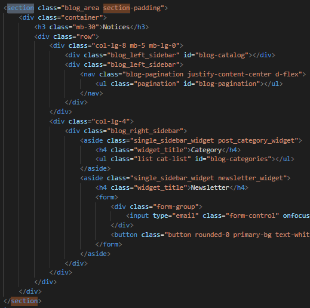

## 3.7 Implementation details

_Show here how you have fullfilled the miminum required objectives and which valorization elements you added to your work.

section - The tag defines a section in a document. For example, we use the "blog.html" page to contain all the type of information presented on the page.

  
_Section example_

article - The tag specifies independent, self-contained content. An article should make sense on its own and it should be possible to distribute it independently from the rest of the site. Está a ser utilizado no javaSvript mas irá aparecer na página. It is being used in javaSvript but will appear on the page.

  
_Article example_

nav - The tag defines a set of navigation links. Notice that NOT all links of a document should be inside a  element. The element is intended only for major block of navigation links. Browsers, such as screen readers for disabled users, can use this element to determine whether to omit the initial rendering of this content.

  
_Nav example_

aside - The tag defines some content aside from the content it is placed in

  
_Aside example_

  
_Aside example on "blog.html"_

adress - The tag defines the contact information for the author/owner of a document or an article.

  
_Adress example_

  
_Address example on "contact_us.hmtl"_

header - The element represents a container for introductory content or a set of navigational links.

  
_Header example_

  
_Header example on "index.hmtl"_

footer - The tag defines a footer for a document or section.

  
_Footer example_

  
_Footer example on "index.hmtl"_

figure - The tag specifies self-contained content, like illustrations, diagrams, photos, code listings, etc.

  
_Figure example_

main - The tag specifies the main content of a document.

  
_Main example on "index.html"_

div - The tag defines a division or a section in an HTML document.

  
_Div example on "index.html"_

table - A table in HTML consists of table cells inside rows and columns. In this program the table is being used on the "blog.xml" page as this file will be rendered on the respective news page.

  
_Table example on "blog.xml"_

  
_Table example on "blog_details.html"_

ol - The tag defines an ordered list. An ordered list can be numerical or alphabetical. The tag is used to define each list item.

  
_Ol example on "blog.xml"_

  
_Ol example on "blog_details.html"_

ul - The tag defines an unordered (bulleted) list. Use the tag together with the tag to create unordered lists.

  
_UL example on "blog.html"_

  
_UL example on "blog.html"_

img - The tag is used to embed an image in an HTML page.

  
_IMG example on "about_us.html"_

figcaption -  The tag defines a caption for a figure element.

  
_Figcaption example on "blog.xml"_

strong - The tag is used to define text with strong importance. The content inside is typically displayed in bold.

  
_Strong example on "blog.xml"_

mark - 
